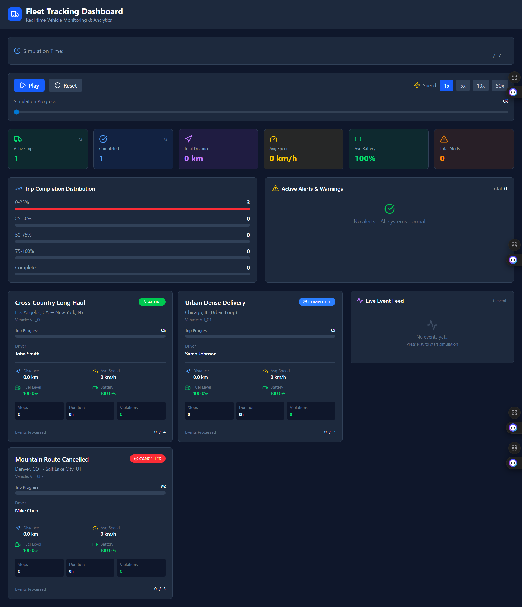

# Fleet Tracking Application



A modern, real-time fleet tracking application built with React and Vite. Monitor your vehicle fleet with live location updates, trip tracking, and detailed analytics.

## ✨ Features

- 🚗 Real-time vehicle tracking
- 📍 Live location updates
- 🚦 Trip status monitoring (In Progress, Completed, Cancelled)
- ⚡ Speed violation alerts
- 📊 Trip analytics and statistics
- 📱 Responsive design for all devices
- 🌐 Interactive map view
- 🔔 Real-time notifications for events

## 🚀 Getting Started

### Prerequisites

- Node.js (v16 or later)
- npm (v8 or later) or yarn

### Installation

1. Clone the repository:
   ```bash
   git clone https://github.com/yourusername/fleet-tracking-application.git
   cd fleet-tracking-application
   ```

2. Install dependencies:
   ```bash
   npm install
   # or
   yarn install
   ```

3. Start the development server:
   ```bash
   npm run dev
   # or
   yarn dev
   ```

4. Open [http://localhost:5173](http://localhost:5173) in your browser.

## 🛠️ Built With

- [React](https://reactjs.org/) - Frontend library
- [Vite](https://vitejs.dev/) - Build tool
- [Tailwind CSS](https://tailwindcss.com/) - Styling
- [Lucide Icons](https://lucide.dev/) - Icon library
- [React Router](https://reactrouter.com/) - Client-side routing

## 📂 Project Structure

```
src/
├── components/     # Reusable UI components
├── hooks/         # Custom React hooks
├── utils/         # Utility functions
├── data/          # Sample data and types
└── App.jsx        # Main application component
```

## 📝 Sample Data

The application comes with sample trip data that includes:

- Trip details (ID, name, driver, route)
- Vehicle information
- Location history
- Movement data (speed, heading, distance)
- Device status (battery, signal quality)
- Event history (starts, stops, violations, alerts)

## 📱 Responsive Design

The application is fully responsive and works on:

- Desktop computers
- Tablets
- Mobile devices

## 📊 Features in Detail

### Real-time Tracking
- Live vehicle location updates
- Trip progress monitoring
- Route visualization

### Alerts & Notifications
- Speed violation alerts
- Device status notifications
- Trip status changes

### Analytics
- Distance traveled
- Average speed
- Trip duration
- Fuel efficiency metrics

## 🤝 Contributing

Contributions are welcome! Please read our [contributing guidelines](CONTRIBUTING.md) to get started.

## 📄 License

This project is licensed under the MIT License - see the [LICENSE](LICENSE) file for details.

## 🙏 Acknowledgments

- [Vite](https://vitejs.dev/) for the amazing development experience
- [React](https://reactjs.org/) for the component-based architecture
- [Tailwind CSS](https://tailwindcss.com/) for the utility-first CSS framework
